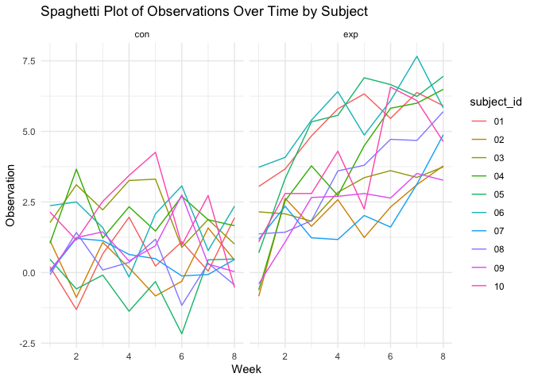
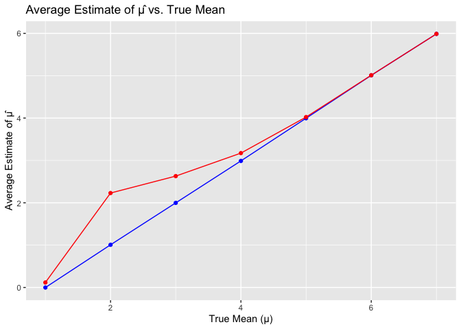

p8105_hw5_ys3765
================
Yixiao Sun
2023-11-08

# Problem 2:

``` r
library(tidyverse)

file_names <- list.files(path = "~/Desktop/P8105_ Data Science/p8105_hw5_ys3765/data/", 
                         pattern = "\\.csv$", 
                         full.names = FALSE)
print(file_names)
```

    ##  [1] "con_01.csv" "con_02.csv" "con_03.csv" "con_04.csv" "con_05.csv"
    ##  [6] "con_06.csv" "con_07.csv" "con_08.csv" "con_09.csv" "con_10.csv"
    ## [11] "exp_01.csv" "exp_02.csv" "exp_03.csv" "exp_04.csv" "exp_05.csv"
    ## [16] "exp_06.csv" "exp_07.csv" "exp_08.csv" "exp_09.csv" "exp_10.csv"

``` r
file_dir <- list.files(path = "~/Desktop/P8105_ Data Science/p8105_hw5_ys3765/data/", 
                       pattern = "\\.csv$", 
                       full.names = TRUE)

data_list <- file_dir %>%
  set_names(nm = file_names) %>%
  map(read_csv)

data_list <- purrr::map2(data_list, 
                  names(data_list), 
                  ~mutate(.x, 
                          subject_id = str_extract(.y,"(?<=_)[^_]+(?=\\.csv)"),
                          arm = str_extract(.y, "[a-z]+")))

combined_data <- bind_rows(data_list, .id = "source")
```

``` r
tidy_data <- combined_data %>%
  pivot_longer(cols = starts_with("week"), 
               names_to = "week", 
               values_to = "observation") %>%
  mutate(week = readr::parse_number(week))

ggplot(tidy_data, aes(x = week, 
                      y = observation, 
                      group = subject_id, 
                      color = subject_id)) +
  geom_line() +
  labs(title = "Spaghetti Plot of Observations Over Time by Subject",
       x = "Week",
       y = "Observation") +
  facet_grid(~arm)+
  theme_minimal()
```

<!-- -->

For the spaghetti plot, for the control group of the data over 8 weeks,
the observation values vary a lot unside down but without any clear
trend for the researchers to see. On the other hand, for the experiment
group, their observation values still vary a lot but mostly showing a
upward trend, which means that the experimental group is showing a
positive effect.

# Problem 3

``` r
library(tidyverse)
library(broom)

n <- 30
sigma <- 5
mu_values <- 0:6
alpha <- 0.05
num_simulations <- 5000

simulate_t_test <- function(mu) {
  data <- rnorm(n, mean = mu, sd = sigma)
  t_test_result <- t.test(data, mu = 0)
  broom::tidy(t_test_result)
}

results <- map_df(mu_values, function(mu) {
  t_tests <- replicate(num_simulations, 
                       simulate_t_test(mu), 
                       simplify = FALSE) %>%
    bind_rows() %>%
    mutate(true_mu = mu)
  t_tests
}, .id = "mu")

power_estimates <- results %>%
  group_by(mu) %>%
  summarize(power = mean(p.value < alpha),
            mean_estimate = mean(estimate),
            mean_estimate_rejected = mean(estimate[p.value < alpha]))

power_plot <- ggplot(power_estimates, 
                     aes(x = as.numeric(mu), 
                         y = power)) +
  geom_point() +
  geom_line() +
  labs(title = "Power vs. True Mean", 
       x = "True Mean (μ)", 
       y = "Power")


power_plot
```

<!-- -->

The plot shows a clear positive association between effect size and
power: as the true mean increases, the power of the test also increases.
This indicates that larger effect sizes make it easier to detect a true
effect, thus increasing the power of the statistical test.

``` r
mean_estimate_plot <- ggplot(power_estimates, 
                             aes(x = as.numeric(mu))) +
  geom_point(aes(y = mean_estimate), 
             color = "blue") +
  geom_line(aes(y = mean_estimate), 
            color = "blue") +
  geom_point(aes(y = mean_estimate_rejected), 
             color = "red") +
  geom_line(aes(y = mean_estimate_rejected), 
            color = "red") +
  labs(title = "Average Estimate of μ̂ vs. True Mean",
       x = "True Mean (μ)", y = "Average Estimate of μ̂")

mean_estimate_plot
```

<!-- -->

The red line is consistently above the blue line, suggesting that the
average estimate of mu is slightly higher than the true mean when the
null hypothesis is rejected. So it can’t be equal. And the reason for
this might due to type 1 error inflation, which is that
